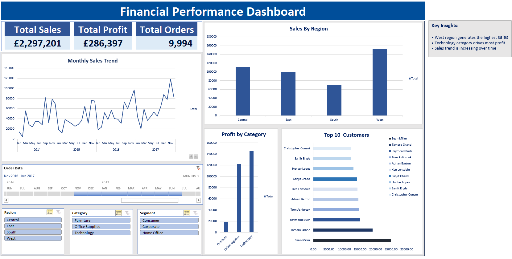

# Credit Risk Data Pipeline & Financial Dashboard

## 📊 Dashboard Preview

---

## 📌 Project Overview

This project demonstrates an end-to-end financial data analysis workflow using a real-world dataset. It focuses on data ingestion, validation, and interactive reporting aligned with financial operations and risk analysis practices.

---

## ⚙️ Tools & Technologies

- Python (Pandas, NumPy)
- Jupyter Notebook
- Microsoft Excel (PivotTables, Charts, Slicers)
- GitHub

---

## 🔍 Key Features

- Structured data ingestion and validation pipeline
- Handling large datasets using sampling techniques
- Identification of data quality issues (missing values, inconsistencies)
- Interactive Excel dashboard for business insights
- Reproducible project structure

---

## 📈 Key Insights

- Sales performance varies significantly across regions
- Technology category drives the highest profit contribution
- Identified trends in monthly sales growth over time
